# Google Analytics

## 安裝 GA 至 GTM

***1. 新增代碼***

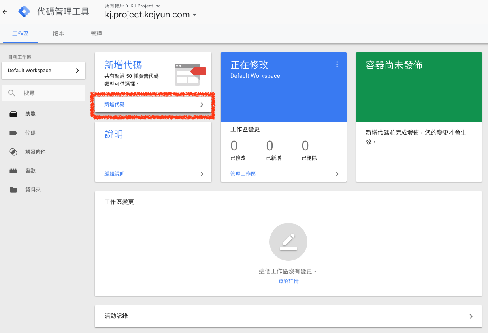

***2. 代碼設定***

選擇 `Google Analytics（分析）- 通用 Analytics（分析）`

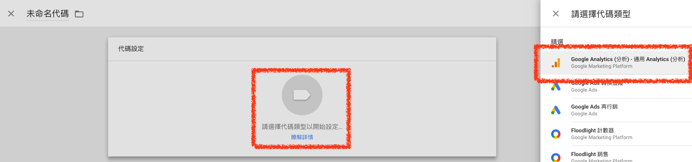

***3. 新增代碼變數***

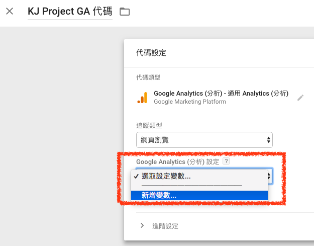

***4. 新增代碼變數追蹤編號***

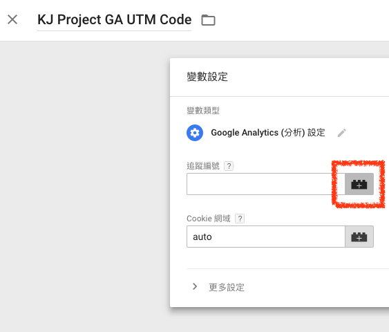

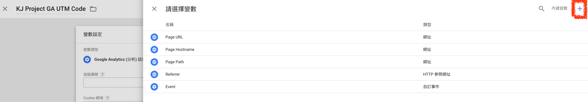

***5. 新增代碼變數追蹤編號常數***

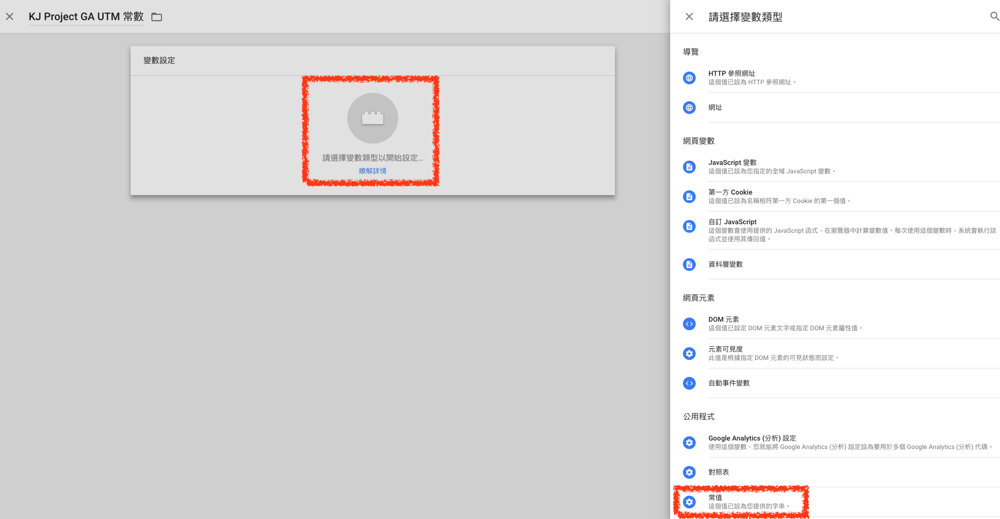

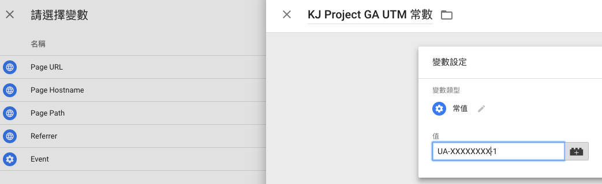

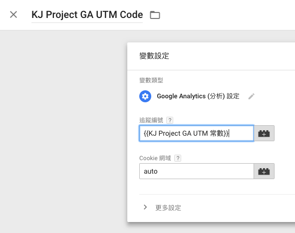

***6. 設定代碼觸發條件***

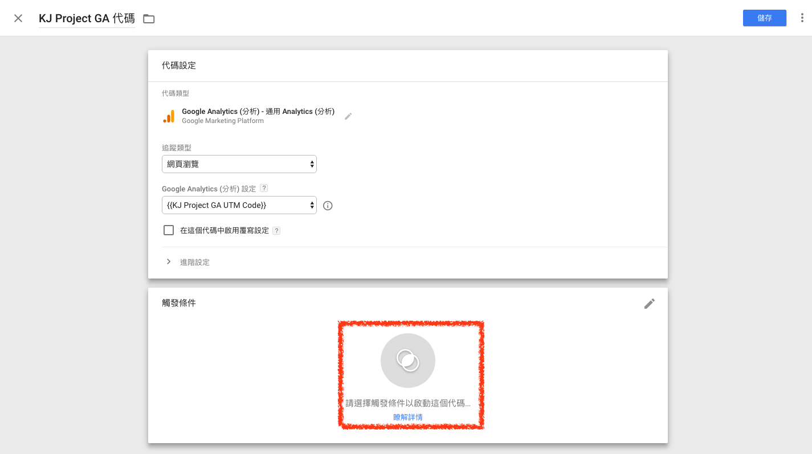

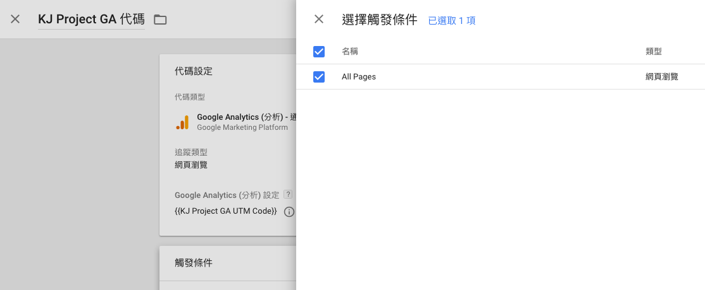

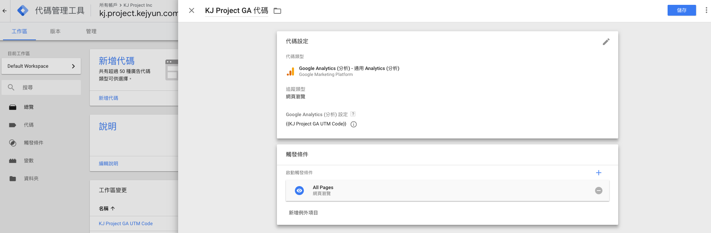

***7. 提交代碼***

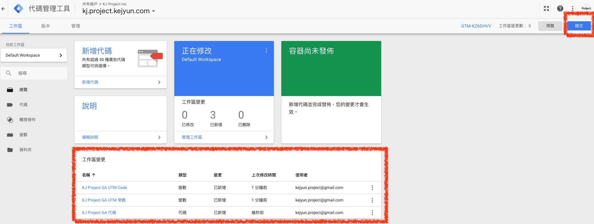

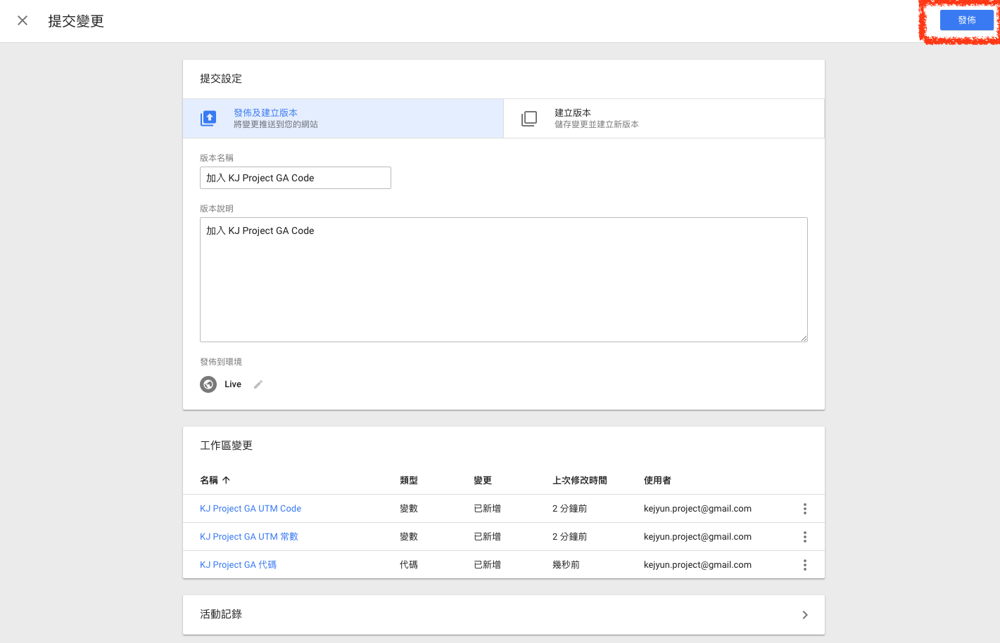

## 參考資料
* [Google Tag Manager 教學，一篇搞懂如何設定和管理網站追蹤碼](https://transbiz.com.tw/google-tag-manager-gtm-%E6%95%99%E5%AD%B8/)
* [【【概念篇】給行銷人的GTM入門－埋GA碼、FB Pixel不求人 – papaya tsai – Medium](https://medium.com/@papaya116/%E6%A6%82%E5%BF%B5%E7%AF%87-%E7%B5%A6%E8%A1%8C%E9%8A%B7%E4%BA%BA%E7%9A%84gtm%E5%85%A5%E9%96%80-%E5%9F%8Bga%E7%A2%BC-fb-pixel%E4%B8%8D%E6%B1%82%E4%BA%BA-2f70f39863d6)
* [【實戰篇】給行銷人的GTM入門－埋GA碼、FB Pixel不求人 – papaya tsai – Medium](https://medium.com/@papaya116/%E5%AF%A6%E6%88%B0%E7%AF%87-%E7%B5%A6%E8%A1%8C%E9%8A%B7%E4%BA%BA%E7%9A%84gtm%E5%85%A5%E9%96%80-%E5%9F%8Bga%E7%A2%BC-fb-pixel%E4%B8%8D%E6%B1%82%E4%BA%BA-d59bef2482a7)
* [【GTM進階篇】如何用GTM設定GA電子商務追蹤 – papaya tsai – Medium](https://medium.com/@papaya116/gtm%E9%80%B2%E9%9A%8E%E7%AF%87-%E5%A6%82%E4%BD%95%E7%94%A8gtm%E8%A8%AD%E5%AE%9Aga%E9%9B%BB%E5%AD%90%E5%95%86%E5%8B%99%E8%BF%BD%E8%B9%A4-346a0cbb8dea)
* [【GTM進階篇】data layer及JSON是什麼，它們如何與GTM互動 – papaya tsai – Medium](https://medium.com/@papaya116/gtm%E9%80%B2%E9%9A%8E%E7%AF%87-data-layer%E5%8F%8Ajson%E6%98%AF%E4%BB%80%E9%BA%BC-%E5%AE%83%E5%80%91%E5%A6%82%E4%BD%95%E8%88%87gtm%E4%BA%92%E5%8B%95-979eae7de2d1)
* [Google Tag Manager 教學，一篇搞懂如何設定和管理網站追蹤碼](https://transbiz.com.tw/google-tag-manager-gtm-%E6%95%99%E5%AD%B8/)
